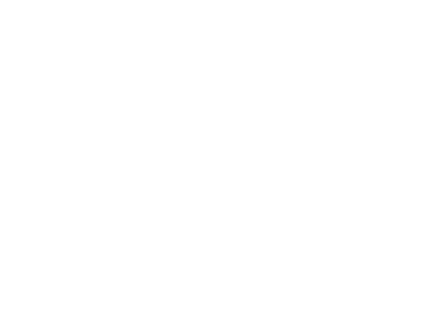

<table border="0">
<td>

  
  
</td>
    <td> 

  

    We totally grok what it takes to build and operate API-first systems, and how these differ from the web-first systems of yesteryear.  
    We believe that observability is the key to coping with the dynamic challenges that API-first teams face on a daily basis.
    

  
</td>
 </tr>
</table>
